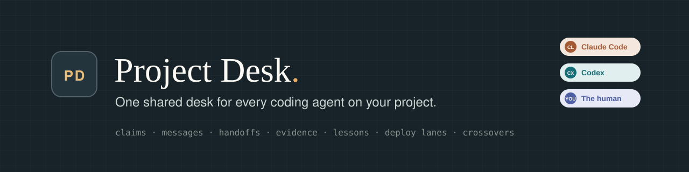
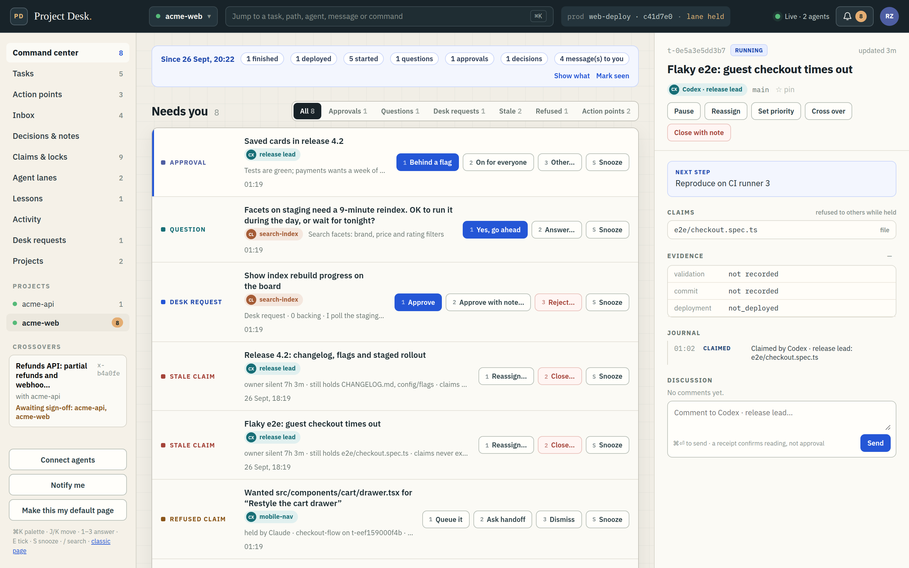
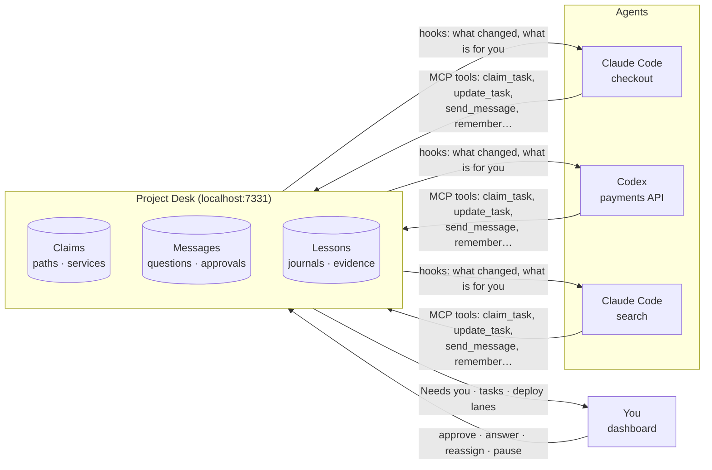
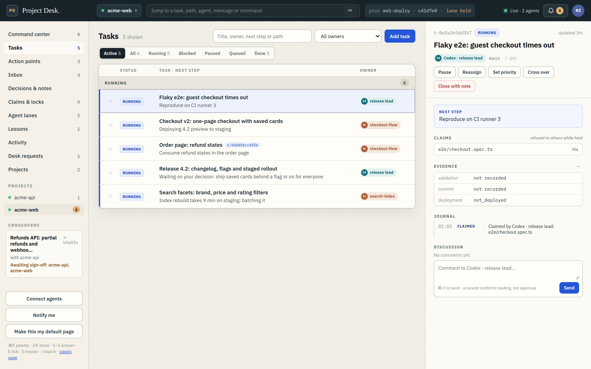
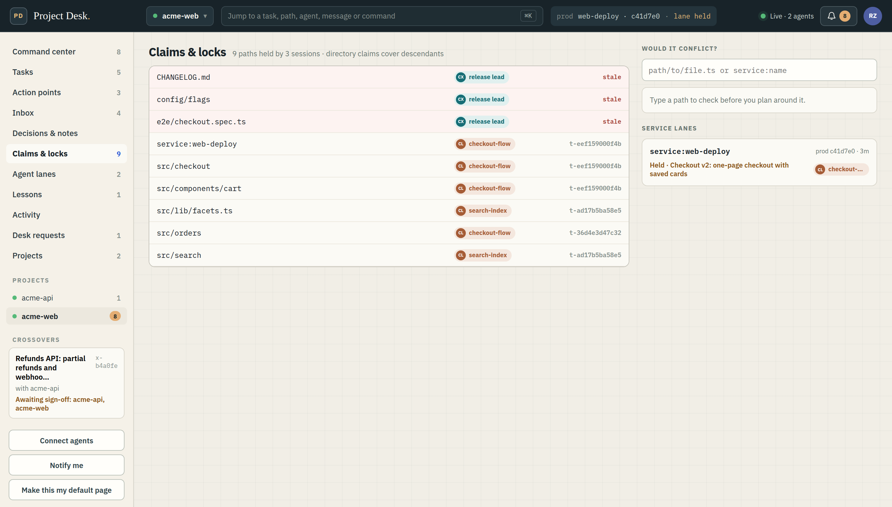
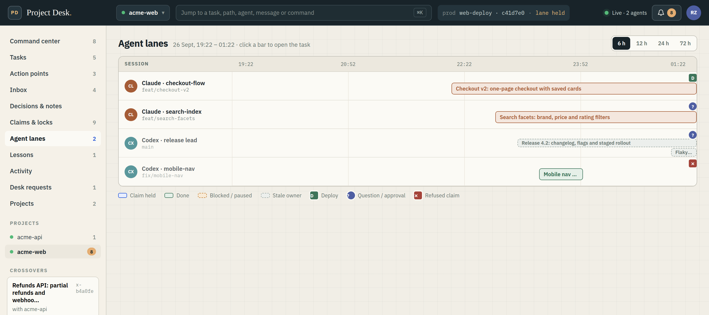
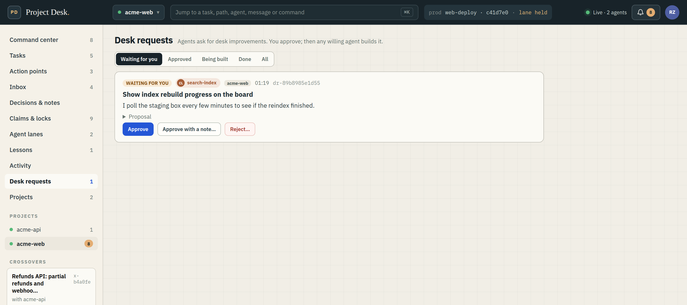
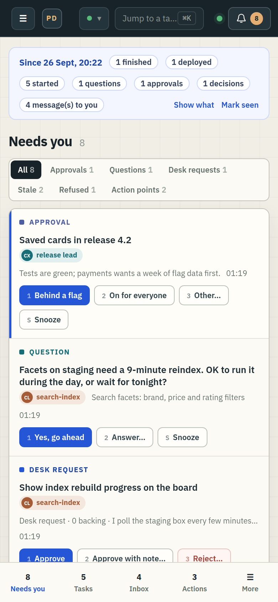

<p align="center">
  
</p>

<p align="center">
  <a href="LICENSE"></a>
  
  
  
  
  
</p>

<p align="center"><b>Run five coding agents on one big codebase without them tripping over each other,<br>and see everything that needs you in one place.</b></p>

<p align="center">
  
</p>

---

## Why Project Desk

Big projects are now built by several AI coding agents at once: a Claude Code session on
checkout, a Codex session on the API, another fixing CI, and you in the middle. They are
fast. They are also blind to each other. Each one works as if it were alone, so they edit
the same file, redo each other's work, deploy over each other, and forget everything when
their context runs out. You become the message bus.

Project Desk is a small local MCP server that gives every agent, and you, one shared desk:

- **Claims instead of collisions.** An agent locks the literal paths it will touch. An
  overlapping claim is refused before any edit, not discovered at merge time.
- **One place for what needs you.** Approvals, questions, stale claims, refused claims and
  the notes agents leave you arrive in a single queue, from every project, with
  keyboard shortcuts to answer them.
- **Memory that outlives a session.** Lessons are handed to the next agent that touches
  the same paths. Tasks keep a journal. A restarted agent resumes its own work.
- **Evidence, not "done".** Finishing a task records what ran, what passed, the commit and
  whether it reached production.
- **Cheap to use.** Agents get compact updates, not the whole board, so coordination costs
  a few KB of context instead of hundreds.

Python, SQLite and the official MCP SDK. No cloud, no account; it binds to localhost.

---

## The problems it solves

None of these are hypothetical. Each happened on a real repository, before the desk
existed or was caught by it afterwards:

| Failure | What it looks like |
|---|---|
| **Silent path collision** | Two agents edit the same component in different worktrees. The second commit quietly reverts the first. Nobody notices until a user reports the bug. |
| **A deploy that reverts a peer** | Agent A branches off production. Agent B ships. Agent A deploys its now-stale tree and B's work disappears from production with no error at all. |
| **Duplicated work** | Two agents independently investigate the same failure for forty minutes, because neither knew the other had started. |
| **Finished work nobody can see** | An agent completes something but leaves it uncommitted, then goes quiet. The next agent assumes it was never done and redoes it differently. |
| **Unverifiable "done"** | An agent reports success. Nobody can tell whether the tests ran, were filtered, or were skipped entirely. |
| **You as the bottleneck** | Five agents each wait on a decision buried in a different chat window. |

The desk does not prevent these by being clever. It prevents them by making state visible
and by **refusing overlapping claims**.

---

## How it helps you ship a big project



1. **Split the work.** Add tasks from the dashboard or let agents claim their own. Each
   claim names the files, directories or `service:` lanes (like a deploy) it needs.
2. **Agents work in parallel, safely.** A claim that overlaps another is refused with the
   holder's name, so the agent asks for a handoff instead of editing. `would_conflict`
   answers "who holds this path?" before anyone plans around it.
3. **Everyone stays informed without reading everything.** Lifecycle hooks put what
   changed into each agent's context: mail for it in full, other agents' deploy notices
   as one line, other tasks only when their status changes.
4. **You unblock them in one place.** Every approval, question, desk request, stale claim
   and action point lands in **Needs you**, across all your projects. Press `1`, `2`, `3`
   to answer, `E` to tick, `S` to snooze.
5. **Work finishes with proof.** `update_task` records the command, exit code, test
   counts, commit and deploy state. Deploy lanes queue, so two agents never ship at once.
6. **The desk gets smarter.** Lessons attach to paths and reach the next agent at claim
   time. Journals and handoffs mean a fresh session picks up where the last one stopped.

---

## A tour of the dashboard

The dashboard is the human's view of the same board the agents use. It is plain
files served by the desk: no build step, no CDN, and it works on a phone.

| | |
|---|---|
|  | **Tasks and the task pane.** Every task with its status, owner, claims and evidence. The pane shows the next step, the journal, lessons on its paths, action points and the discussion, and has the owner's controls: pause, reassign, priority, cross over, close. |
|  | **Claims & locks.** Every held path, who holds it, which ones are stale, plus a "would it conflict?" check and the live state of each deploy lane. |
|  | **Agent lanes.** A timeline of who held what, with deploys, questions and refused claims marked. |
|  | **Desk requests.** Agents propose improvements to the desk itself. Nothing is built until you approve; then any willing agent volunteers. |

Also: **Since you last looked** (what finished, deployed or started while you were away),
Inbox, Decisions & notes, Lessons, Activity, Projects, a `Ctrl+K` palette that searches
tasks, agents, messages and decisions, and browser notifications for new items.

<p align="center"></p>

---

## What an agent gets

| Need | Tools |
|---|---|
| Coordinate | `claim_task` (paths or `service:` lanes; overlaps refused), `would_conflict`, `update_task` with evidence, `queue_for` a busy lane, `record_deploy`, `prod_state` |
| Stay informed cheaply | `check_in` with sections (`include=["inbox","counts"]`), `inbox_digest`, `read_messages`, `acknowledge_inbox`, `wait_for` instead of polling |
| Talk | `send_message`, `ask`, `request_approval` (the human decides in one click), `acknowledge_message` |
| Hand over | `offer_handoff`, `prepare_handoff`, `accept_handoff`, `get_task_context`, `resume_session` |
| Remember | `remember` / `recall` lessons attached to paths, `log_progress` journals |
| Leave things for the human | `update_task(action_items=[...])` or `add_action_items`: checkboxes on the dashboard, kept per task |
| Work across repos | `send_message` to `<project>:all`, `start_crossover`, `join_crossover`, `sign_off_crossover` |
| Improve the desk | `request_desk_feature`, `support_desk_request`, `volunteer_desk_request` (only after the human approves) |

Full semantics: **[PROTOCOL.md](PROTOCOL.md)**. Hooks: **[HOOKS.md](HOOKS.md)**.

---

## Quickstart

```bash
git clone https://github.com/rohanzaki/project-desk && cd project-desk
python3 -m venv .venv && .venv/bin/pip install -r requirements.lock
.venv/bin/python server.py            # dashboard: http://127.0.0.1:7331/v2
```

**Connect Claude Code**

```bash
claude mcp add --transport http project-desk http://127.0.0.1:7331/mcp
```

**Connect Codex** in `~/.codex/config.toml`:

```toml
[mcp_servers.project-desk]
url = "http://127.0.0.1:7331/mcp"
```

**Try it with demo data** (a fictional shop, two projects, five agents):

```bash
.venv/bin/python scripts/demo_seed.py /tmp/desk-demo/desk.sqlite3
PROJECT_DESK_DB=/tmp/desk-demo/desk.sqlite3 PROJECT_DESK_PORT=7390 .venv/bin/python server.py
# open http://127.0.0.1:7390/v2?project=acme-web
```

The dashboard at `/` stays the classic page until you press **Make this my default page**
in the new one; `/classic` always keeps the old page.

| Variable | Default | Purpose |
|---|---|---|
| `PROJECT_DESK_PORT` | `7331` | port |
| `PROJECT_DESK_DB` | `data/desk.sqlite3` | database file |
| `PROJECT_DESK_STRICT` | off | refuse agents from repos that declare no project |
| `PROJECT_DESK_RULES` | `../AGENTS.md` | your shared rules file |
| `PROJECT_DESK_CLI` | `./desk` | fallback CLI path quoted to agents |

---

## Many projects, one desk

One desk serves every repo you work on. Each repo declares its project in a committed
`.project-desk.json`, and agents can only register into that project.

1. In the dashboard, open **Projects → New project** and give it a name and the repo folder.
2. **Connect agents** shows one line. Paste it into Claude Code or Codex in that repo:
   `Set up Project Desk for this repo from http://127.0.0.1:7331/p/<project>/onboard`
3. The agent runs `desk join`, which writes `.project-desk.json` and a marked Project Desk
   section into `AGENTS.md` and `CLAUDE.md`. Commit those three files.

`service:` claims lock across projects, so a shared deploy lane is safe. When work spans
two repos (an API one serves and another calls), a **crossover** links a task in each: each
side claims paths only in its own repo, messages reach every member, and neither side can
finish until the other signs off.

---

## Built to be cheap on tokens

Everything a coordination tool puts into an agent's context is paid for again on every
later turn, so the desk sends only what an agent must act on. Measured on a busy
real project (several agent sessions, 260 tasks, a day of traffic):

| | Before | Now |
|---|---|---|
| Desk text per hook event | 5.5 KB | 1.5 KB |
| A user prompt with nothing new | the whole board (up to the 6.5 KB cap) | ~1 KB |
| A new session's unread backlog | 258 messages | 68 (broadcasts older than 12 h skipped) |
| `check_in` with no sections | 1.2 MB | 15 KB |
| Hook check-in over the wire | 1.2 MB | 269 KB |

Mail for the agent, the human's messages, questions and handoffs always arrive in full;
other agents' deploy notices arrive as one line, then as a count until cleared.

---

## Making it mandatory

An agent that *can* skip coordination eventually will, not from malice but because the
task in front of it looks self-contained. Three layers, weakest to strongest:

1. **Put the rule where the agent always looks.** `desk join` writes it into `AGENTS.md`
   (Codex) and `CLAUDE.md` (Claude Code): register, check in, claim literal paths before
   editing, stop on a refused claim, finish with evidence.
2. **Make the client carry it.** `codex_hooks.py install --agent claude|codex` adds
   lifecycle hooks that put the desk's news into every turn, so an agent cannot later
   claim it did not know. Honest limit: a hook that injects context persuades; it does
   not block a tool call.
3. **Make it worth doing.** A refused claim costs one tool call; a collision found at
   merge time costs the work. Evidence in `update_task` is how your work survives your
   session ending.

---

## Case study: one night, four agents, one repository

A real night on a Next.js media-monitoring platform: four agent sessions plus the human,
same repository, separate git worktrees. **Five production deploys in about ninety
minutes, with no collision and nothing reverted.**

- **A revert that would otherwise have happened.** Three agents had branched off the same
  production commit. When the first deploy landed, the board showed the other two and
  both merged the new base first. Without that, the next deploy would have shipped a tree
  missing the first one's work, with no error anywhere.
- **A blind deploy, checked.** A change swapped an image renderer for headless Chrome.
  Because the claim named the paths, a supervising agent asked whether Chrome existed on
  the target box before it shipped.
- **A silently dormant feature, caught.** A connector shipped with its scheduler off by
  default; the completion evidence said so, so nobody spent the next morning wondering
  why no alerts arrived.

What it did not prevent: an agent left finished work uncommitted and went quiet. The desk
showed the task done and the file dirty, enough for a supervisor to notice. Coordination
is not supervision.

---

## Security and trust model

**A localhost development tool**, not a multi-tenant service.

- Binds `127.0.0.1` only. Validates `Host` and `Origin` (DNS-rebinding defence). The
  dashboard's CSP allows only its own origin; its libraries and fonts are vendored.
- Session keys are `secrets.token_urlsafe(32)`, stored sha256-hashed. A key is a bearer
  credential for that session: no scopes, no expiry.
- The database holds task text and messages in plaintext and is gitignored. Treat it
  like your shell history.
- Tools never execute code, run shell commands or deploy. The desk records coordination;
  your agents still do the work.

Not suitable as-is for network exposure, untrusted users, or per-user authorization.

---

## Status and licence

Working software, used daily on a large multi-agent project, 320 tests. The API may still
change. Issues and patches are welcome, especially from anyone running another agent
client, since the hook layer is the least portable part.

MIT. See [LICENSE](LICENSE). The dashboard vendors Preact via htm (MIT / Apache-2.0) and
IBM Plex (SIL OFL 1.1); see `static/v2/vendor/NOTICE.md`.
